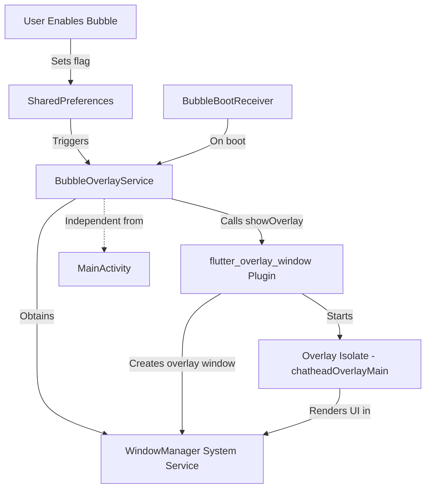

# Design Document: System-Wide Floating Bubble Overlay

## Overview

The floating bubble overlay fix transforms the current app-only overlay into a true system-wide overlay similar to Facebook Messenger chat heads. The core issue is that the current implementation relies on MainActivity to manage the overlay, which only works when the Flutter app is in the foreground.

The fix involves:
1. Moving overlay management from MainActivity to a dedicated native Android service (BubbleOverlayService)
2. Properly configuring the WindowManager and overlay window parameters for system-wide display
3. Using flutter_overlay_window plugin correctly to render Flutter UI in the system overlay
4. Implementing boot persistence and lifecycle independence

The solution builds upon the existing chathead_sos_service.dart implementation and BubbleOverlayService.kt skeleton, extending them with proper native window management.

## Architecture

### Current Architecture (Broken)
```
User enables bubble → MainActivity.startFlutterOverlay()
                    ↓
            FlutterOverlayWindow.showOverlay() called from MainActivity
                    ↓
            Overlay only appears when Flutter app is foreground
                    ↓
            User switches to home screen → Overlay disappears
```

### Fixed Architecture
```
User enables bubble → Start BubbleOverlayService as foreground service
                    ↓
            BubbleOverlayService.onCreate() initializes WindowManager
                    ↓
            BubbleOverlayService calls FlutterOverlayWindow.showOverlay()
                    ↓
            Flutter overlay isolate runs independently
                    ↓
            WindowManager maintains overlay over ALL apps
                    ↓
            Service persists regardless of MainActivity state
```

### Component Interaction Diagram



## Components and Interfaces

### 1. BubbleOverlayService (Kotlin)

**Purpose:** Native Android foreground service that manages the system-wide overlay lifecycle independent of MainActivity.

**Key Methods:**
```kotlin
class BubbleOverlayService : Service() {
    private var windowManager: WindowManager? = null
    private var overlayView: View? = null
    
    override fun onStartCommand(intent: Intent?, flags: Int, startId: Int): Int
    // - Creates foreground notification
    // - Verifies SYSTEM_ALERT_WINDOW permission
    // - Initializes WindowManager
    // - Calls FlutterOverlayWindow.showOverlay()
    // - Returns START_STICKY for restart after kill
    
    override fun onDestroy()
    // - Calls FlutterOverlayWindow.closeOverlay()
    // - Cleans up WindowManager resources
    
    private fun checkOverlayPermission(): Boolean
    // - Returns Settings.canDrawOverlays(this)
    
    private fun createNotification(): Notification
    // - Creates persistent foreground notification
    
    private fun startFlutterOverlay()
    // - Configures and shows Flutter overlay using plugin
}
```

**Integration Points:**
- Receives start/stop commands via Intent from Dart code
- Uses `flutter_overlay_window` plugin to manage Flutter overlay
- Maintains foreground notification while active
- Communicates with SharedPreferences for state persistence

### 2. Modified MainActivity (Kotlin)

**Purpose:** Simplified to only handle permission requests and forward commands to BubbleOverlayService.

**Key Changes:**
```kotlin
class MainActivity : FlutterActivity() {
    private fun startBubble() {
        // Verify permission
        if (!Settings.canDrawOverlays(this)) {
            requestOverlayPermission()
            return
        }
        
        // Start the service instead of managing overlay directly
        val intent = Intent(this, BubbleOverlayService::class.java)
        intent.action = "START_OVERLAY"
        startForegroundService(intent)
    }
    
    private fun stopBubble() {
        val intent = Intent(this, BubbleOverlayService::class.java)
        stopService(intent)
    }
}
```

**Integration Points:**
- MethodChannel receives commands from Dart
- Forwards commands to BubbleOverlayService via Intent
- Only handles permission UI flow

### 3. BubbleBootReceiver (Kotlin)

**Purpose:** Broadcast receiver that auto-starts the overlay service on device boot if it was enabled.

**Key Methods:**
```kotlin
class BubbleBootReceiver : BroadcastReceiver() {
    override fun onReceive(context: Context, intent: Intent) {
        if (intent.action == Intent.ACTION_BOOT_COMPLETED) {
            // Check SharedPreferences for bubble_should_show flag
            val prefs = context.getSharedPreferences("FlutterSharedPreferences", Context.MODE_PRIVATE)
            val shouldShow = prefs.getBoolean("flutter.bubble_should_show", false)
            val isEnabled = prefs.getBoolean("flutter.floating_bubble_enabled", true)
            
            if (shouldShow && isEnabled) {
                // Verify permission
                if (Settings.canDrawOverlays(context)) {
                    val serviceIntent = Intent(context, BubbleOverlayService::class.java)
                    serviceIntent.action = "START_OVERLAY"
                    context.startForegroundService(serviceIntent)
                }
            }
        }
    }
}
```

### 4. ChatheadSosService (Dart)

**Purpose:** Dart-side API for controlling the overlay bubble from the Flutter app.

**Modified Methods:**
```dart
class ChatheadSosService {
  static const _channel = MethodChannel('com.example.lifeguard360/chat_head');
  
  static Future<void> show() async {
    final prefs = await SharedPreferences.getInstance();
    await prefs.setBool('bubble_should_show', true);
    
    // Call native method to start service
    try {
      await _channel.invokeMethod('startBubble');
    } catch (e) {
      debugPrint('Error starting bubble: $e');
    }
  }
  
  static Future<void> hide() async {
    final prefs = await SharedPreferences.getInstance();
    await prefs.setBool('bubble_should_show', false);
    
    // Call native method to stop service
    try {
      await _channel.invokeMethod('stopBubble');
    } catch (e) {
      debugPrint('Error stopping bubble: $e');
    }
  }
}
```

### 5. Overlay Isolate (Dart)

**Purpose:** Separate Dart isolate that renders the floating bubble UI.

**No changes needed** - The existing `chatheadOverlayMain()` function in chathead_sos_service.dart already works correctly once the native service properly initializes the overlay window.

**Integration Points:**
- Entry point configured in AndroidManifest.xml
- Runs independently in its own isolate
- Polls SharedPreferences for state changes
- Uses flutter_overlay_window plugin APIs for window control

## Data Models

### SharedPreferences State Flags

```dart
// Stored in default SharedPreferences
{
  'flutter.bubble_should_show': bool,        // User wants bubble visible
  'flutter.floating_bubble_enabled': bool,   // Feature enabled globally
  'flutter.chathead_pos_x': double,          // Last X position
  'flutter.chathead_pos_y': double,          // Last Y position
  'flutter.userId': string,                  // For SOS reporting
  'flutter.userName': string,
  'flutter.familyCode': string
}
```

### Intent Actions

```kotlin
// Actions for BubbleOverlayService
const val ACTION_START_OVERLAY = "START_OVERLAY"
const val ACTION_STOP_OVERLAY = "STOP_OVERLAY"
```

### Window Layout Parameters

```kotlin
val params = WindowManager.LayoutParams(
    WindowManager.LayoutParams.MATCH_PARENT,
    WindowManager.LayoutParams.MATCH_PARENT,
    WindowManager.LayoutParams.TYPE_APPLICATION_OVERLAY,
    WindowManager.LayoutParams.FLAG_NOT_FOCUSABLE or
        WindowManager.LayoutParams.FLAG_NOT_TOUCH_MODAL or
        WindowManager.LayoutParams.FLAG_LAYOUT_IN_SCREEN or
        WindowManager.LayoutParams.FLAG_LAYOUT_NO_LIMITS,
    PixelFormat.TRANSLUCENT
)
params.gravity = Gravity.TOP or Gravity.START
params.x = 0
params.y = 0
```

## Error Handling

### Permission Errors

**Scenario:** SYSTEM_ALERT_WINDOW permission not granted

**Handling:**
1. BubbleOverlayService checks permission in `onStartCommand()`
2. If permission denied, service logs error and stops itself
3. MainActivity receives callback and shows permission request UI
4. After permission granted, user must manually enable bubble again

**Code:**
```kotlin
if (!Settings.canDrawOverlays(this)) {
    Log.e(TAG, "SYSTEM_ALERT_WINDOW permission not granted")
    stopSelf()
    return START_NOT_STICKY
}
```

### WindowManager Errors

**Scenario:** WindowManager.addView() throws exception (e.g., permission revoked at runtime)

**Handling:**
1. Catch exception in `startFlutterOverlay()`
2. Log detailed error message
3. Update SharedPreferences to reflect failure
4. Stop service gracefully
5. Send error notification to user

**Code:**
```kotlin
try {
    FlutterOverlayWindow.showOverlay(...)
} catch (e: Exception) {
    Log.e(TAG, "Failed to add overlay view", e)
    prefs.edit().putBoolean("flutter.bubble_should_show", false).apply()
    stopSelf()
    showErrorNotification("Failed to start overlay: ${e.message}")
}
```

### Service Lifecycle Errors

**Scenario:** Service killed by system due to low memory

**Handling:**
1. Service returns `START_STICKY` to request restart
2. On restart, service re-reads SharedPreferences
3. If `bubble_should_show` is still true, re-initialize overlay
4. Position restored from saved preferences

### Overlay Isolate Errors

**Scenario:** chatheadOverlayMain() crashes or fails to start

**Handling:**
1. flutter_overlay_window plugin handles isolate restart
2. Existing error handling in chatheadOverlayMain() logs errors
3. Service remains active and retries overlay initialization
4. If repeated failures, service stops after 3 attempts

## Testing Strategy

### Manual Testing

Since this is primarily native Android integration with UI behavior, the testing strategy focuses on:

1. **Permission Flow Testing**
   - Test without permission → should prompt user
   - Test with permission → overlay should appear immediately
   - Test permission revocation while overlay active → should handle gracefully

2. **System-Wide Overlay Testing**
   - Start bubble in LifeGuard360 app
   - Navigate to home screen → verify bubble visible
   - Open Chrome, YouTube, Settings → verify bubble visible over all apps
   - Verify bubble remains draggable over all apps
   - Verify tap detection works over all apps

3. **Lifecycle Testing**
   - Enable bubble, close LifeGuard360 app → verify bubble persists
   - Enable bubble, force-stop LifeGuard360 app → verify bubble stops
   - Enable bubble, reboot device → verify bubble auto-starts
   - Enable bubble, clear app data → verify bubble stops

4. **Service Integration Testing**
   - Start service, verify foreground notification appears
   - Stop service, verify notification disappears
   - Kill service via ADB, verify it restarts (START_STICKY)
   - Monitor service lifecycle with `adb logcat`

5. **Error Condition Testing**
   - Revoke SYSTEM_ALERT_WINDOW during operation
   - Test on Android 10+ with different permission states
   - Test with battery optimization enabled
   - Test with restricted background activity

### Integration Testing

**No property-based testing is applicable** for this fix because:
- The bug is in native Android integration, not pure function logic
- Behavior is side-effect driven (window management, service lifecycle)
- Testing requires real Android system services (WindowManager, ActivityManager)

Instead, use:
- **Instrumented Android tests** with Espresso for UI verification
- **Service lifecycle tests** using AndroidJUnit4
- **Permission state tests** using Robolectric for unit-level service testing

### Acceptance Testing

For each requirement, verify:

**Requirement 1:** System-Wide Overlay Visibility
- Manual test: Navigate to 5 different apps, verify bubble visible in all

**Requirement 2:** Native Service Management  
- Manual test: Close main app, verify bubble persists
- Check: `adb shell dumpsys activity services | grep BubbleOverlay`

**Requirement 3:** Proper Window Configuration
- Manual test: Verify touch events work on underlying apps
- Check: Logcat shows TYPE_APPLICATION_OVERLAY being used

**Requirement 4:** Permission Verification
- Manual test: Deny permission → verify error message
- Manual test: Grant permission → verify overlay starts

**Requirement 5:** Communication
- Check: Logcat shows MethodChannel communication
- Manual test: Enable/disable from settings → verify service responds

**Requirement 6:** Boot Persistence
- Manual test: Enable bubble, reboot device, verify bubble appears after boot

**Requirement 7:** Lifecycle Independence
- Manual test: Destroy MainActivity while bubble active → verify bubble continues

**Requirement 8:** Native Window Management
- Check: Logcat shows WindowManager.addView() calls

**Requirement 9:** Plugin Integration
- Check: Logcat shows flutter_overlay_window initialization

**Requirement 10:** Error Handling
- Manual test: Trigger errors, verify graceful degradation and user feedback

## Implementation Notes

### Android Version Compatibility

- **Android 6.0 - 7.1:** Uses TYPE_SYSTEM_ALERT (deprecated)
- **Android 8.0+:** Uses TYPE_APPLICATION_OVERLAY (required)
- The plugin handles this internally, but service must verify API level

### Battery Optimization

Users may need to disable battery optimization for LifeGuard360 to ensure the service isn't killed:
```kotlin
val intent = Intent(Settings.ACTION_REQUEST_IGNORE_BATTERY_OPTIMIZATIONS)
intent.data = Uri.parse("package:$packageName")
startActivity(intent)
```

### Security Considerations

- SYSTEM_ALERT_WINDOW is a dangerous permission
- Users must explicitly grant it
- Overlay can potentially be used for clickjacking attacks
- Ensure overlay doesn't capture sensitive information from other apps
- The bubble itself doesn't capture screenshots or read other app data

### Performance Considerations

- Foreground service keeps process alive → minimal battery impact
- Flutter overlay isolate runs continuously → ~20-50MB memory overhead
- WindowManager updates are efficient for drag operations
- No significant CPU usage when bubble is idle

### Plugin Limitations

The `flutter_overlay_window: ^0.5.0` plugin:
- Handles Flutter engine initialization in overlay window
- Manages isolate communication automatically
- Provides showOverlay/closeOverlay APIs
- Does NOT handle service management (we implement this)
- Does NOT handle boot receiver (we implement this)

## Migration Path

### Existing Users

For users who already have the broken implementation:
1. Existing bubble_should_show preference is preserved
2. On app update, if bubble was "enabled", it won't actually be showing
3. User must toggle bubble off and on again to trigger new service
4. No data loss, position preferences are preserved

### Rollout Strategy

1. Deploy fix in beta channel first
2. Monitor crash reports and permission denials
3. Gather telemetry on service crashes and restarts
4. Full rollout after 2-week beta period

## Future Enhancements

Not part of this bug fix, but potential improvements:

1. **Minimize to Dot:** When idle for 30 seconds, shrink bubble to small dot
2. **Smart Positioning:** Remember position per app (e.g., right side in YouTube, left side in Chrome)
3. **Gestures:** Swipe bubble to edges to temporarily hide it
4. **Accessibility:** TalkBack support for visually impaired users
5. **Multi-Bubble:** Support multiple bubbles for different functions (SOS, quick call, etc.)
