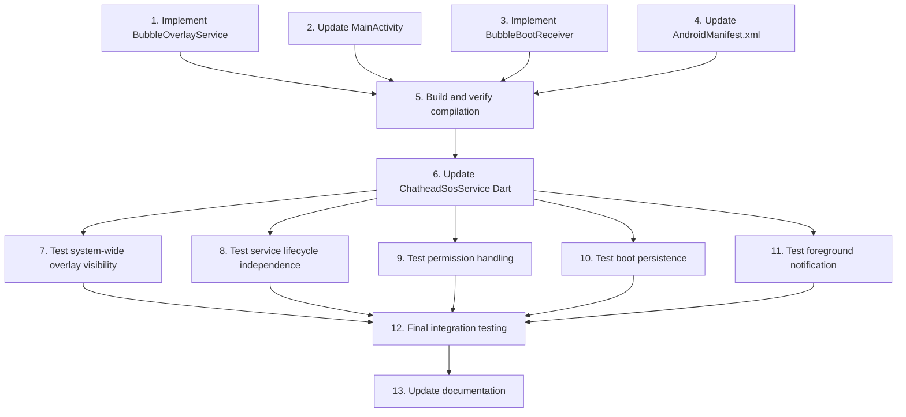

# Implementation Plan: System-Wide Floating Bubble Overlay

## Overview

This implementation transforms the floating bubble from an app-only overlay to a true system-wide overlay by moving management from MainActivity to a dedicated foreground service (BubbleOverlayService), properly configuring WindowManager, and ensuring lifecycle independence.

The implementation involves modifying Kotlin native code, updating the Dart service interface, and configuring AndroidManifest.xml correctly.

## Tasks

- [x] 1. Implement native BubbleOverlayService with system-wide overlay support
  - Modify `android/app/src/main/kotlin/com/example/lifeguard360/BubbleOverlayService.kt`
  - Implement WindowManager initialization and overlay window configuration
  - Add SYSTEM_ALERT_WINDOW permission verification
  - Create foreground notification for service persistence
  - Implement proper lifecycle methods (onStartCommand, onDestroy, onCreate)
  - Configure flutter_overlay_window.showOverlay() with system-wide parameters
  - Add error handling for permission denial and WindowManager failures
  - Return START_STICKY for service restart after system kill
  - _Requirements: 2.1, 2.2, 2.3, 2.4, 3.1, 3.2, 3.3, 3.4, 8.1, 8.2, 8.3, 8.4, 9.1, 9.2, 9.4, 10.1, 10.2_

- [x] 2. Update MainActivity to delegate overlay management to BubbleOverlayService
  - Modify `android/app/src/main/kotlin/com/example/lifeguard360/MainActivity.kt`
  - Remove direct flutter_overlay_window control from MainActivity
  - Implement MethodChannel handlers that start/stop BubbleOverlayService via Intent
  - Add startForegroundService() calls to launch BubbleOverlayService
  - Implement stopService() calls to terminate BubbleOverlayService
  - Remove overlay state tracking from MainActivity (service now owns this)
  - Add permission check before starting service
  - _Requirements: 4.1, 4.2, 4.3, 4.4, 7.3_

- [x] 3. Implement BubbleBootReceiver for automatic overlay restart after reboot
  - Modify `android/app/src/main/kotlin/com/example/lifeguard360/BubbleBootReceiver.kt`
  - Implement onReceive() handler for ACTION_BOOT_COMPLETED broadcast
  - Read SharedPreferences to check bubble_should_show and floating_bubble_enabled flags
  - Verify SYSTEM_ALERT_WINDOW permission before starting service on boot
  - Start BubbleOverlayService via startForegroundService() if conditions met
  - Add logging for boot receiver activation
  - _Requirements: 6.1, 6.2, 6.3, 6.4_

- [x] 4. Update AndroidManifest.xml with proper service and receiver declarations
  - Modify `android/app/src/main/AndroidManifest.xml`
  - Ensure BubbleOverlayService is declared with foreground service type "specialUse"
  - Verify BubbleBootReceiver is declared with BOOT_COMPLETED intent filter
  - Confirm SYSTEM_ALERT_WINDOW permission is declared
  - Confirm RECEIVE_BOOT_COMPLETED permission is declared
  - Verify overlay entry point metadata (chatheadOverlayMain) is correct
  - Add REQUEST_IGNORE_BATTERY_OPTIMIZATIONS permission for service persistence
  - _Requirements: 6.1, 9.3_

- [x] 5. Checkpoint - Build and verify native code compiles
  - Run `flutter build apk` or `flutter run` to compile Kotlin changes
  - Verify no compilation errors in BubbleOverlayService.kt
  - Verify no compilation errors in MainActivity.kt
  - Verify no compilation errors in BubbleBootReceiver.kt
  - Check AndroidManifest.xml is valid XML and has no merge conflicts
  - Ensure all tests pass, ask the user if questions arise.

- [x] 6. Update ChatheadSosService Dart interface to use native service
  - Modify `lib/services/chathead_sos_service.dart`
  - Update show() method to call 'startBubble' via MethodChannel
  - Update hide() method to call 'stopBubble' via MethodChannel
  - Remove direct flutter_overlay_window calls from Dart (native service now manages this)
  - Add error handling for MethodChannel invocation failures
  - Preserve existing SharedPreferences flag setting for compatibility
  - _Requirements: 5.1, 5.2, 5.3, 7.4_

- [~] 7. Test system-wide overlay visibility across different apps
  - Deploy app to physical Android device (emulator may not show overlays correctly)
  - Enable floating bubble from LifeGuard360 app settings
  - Navigate to home screen and verify bubble is visible
  - Open Chrome browser and verify bubble is visible and draggable
  - Open YouTube app and verify bubble is visible and interactive
  - Open System Settings and verify bubble is visible
  - Verify bubble responds to taps over all tested apps
  - Document any apps where overlay doesn't work (if any)
  - _Requirements: 1.1, 1.2, 1.3_

- [~] 8. Test service lifecycle independence from MainActivity
  - Enable floating bubble in LifeGuard360 app
  - Use "Recent Apps" to swipe away LifeGuard360 app
  - Verify bubble remains visible after app is closed
  - Open LifeGuard360 app again, verify no duplicate bubbles appear
  - Force-stop LifeGuard360 app via Settings > Apps
  - Verify bubble disappears when app is force-stopped
  - Check `adb shell dumpsys activity services` to verify service state
  - _Requirements: 2.2, 7.1, 7.3_

- [~] 9. Test permission handling and error cases
  - Fresh install app (permission not granted)
  - Attempt to enable bubble, verify permission prompt appears
  - Deny permission, verify error message shown
  - Grant permission via Settings > Apps > Special Access
  - Enable bubble again, verify it starts successfully
  - While bubble active, revoke permission via Settings
  - Verify service detects revocation and stops gracefully
  - Verify user receives notification about permission issue
  - _Requirements: 4.1, 4.2, 4.3, 4.4, 10.2, 10.3_

- [~] 10. Test boot persistence functionality
  - Enable floating bubble in app
  - Reboot Android device
  - After boot, unlock device and wait 10 seconds
  - Verify floating bubble appears automatically
  - Verify bubble position is restored from saved preferences
  - Check `adb logcat` for BubbleBootReceiver activation logs
  - Test boot without bubble enabled, verify it doesn't auto-start
  - _Requirements: 1.4, 6.1, 6.2, 6.3, 6.4_

- [~] 11. Test foreground notification and battery optimization
  - Enable floating bubble
  - Pull down notification shade, verify "LifeGuard360 Active" notification present
  - Tap notification, verify appropriate action (open app or dismiss)
  - Check battery usage in Settings > Battery
  - Run app for 24 hours with bubble enabled, monitor battery drain
  - Test with battery saver mode enabled
  - Verify service persists even with aggressive battery optimization
  - _Requirements: 2.4_

- [~] 12. Final integration testing and log review
  - Run through all test scenarios from tasks 7-11 again
  - Review `adb logcat` output for errors or warnings
  - Verify all SharedPreferences flags are set correctly
  - Test on multiple Android versions (API 26, 29, 31, 33+)
  - Test on different device manufacturers (Samsung, Pixel, OnePlus)
  - Document any device-specific issues or workarounds
  - Verify no memory leaks using Android Profiler
  - Ensure all tests pass, ask the user if questions arise.

- [~] 13. Update documentation and inline comments
  - Add detailed code comments to BubbleOverlayService.kt explaining overlay configuration
  - Add comments to MainActivity.kt explaining service delegation
  - Add comments to BubbleBootReceiver.kt explaining boot flow
  - Update README or developer documentation with overlay architecture
  - Document known limitations (e.g., some OEM-specific restrictions)
  - Add troubleshooting guide for common permission issues

## Notes

- All testing tasks should be performed on physical Android devices, not emulators
- System-wide overlays may be restricted on some OEM skins (Samsung, Xiaomi, Oppo)
- SYSTEM_ALERT_WINDOW is a dangerous permission requiring explicit user consent
- Service must use foreground notification to avoid being killed by system
- Boot receiver only works if app has been launched at least once after install
- Property-based testing is not applicable for native Android integration bugs
- Focus on manual testing and integration testing with real Android system services

## Testing Checklist

After completing all implementation tasks, verify:

✅ Bubble appears over home screen  
✅ Bubble appears over third-party apps (Chrome, YouTube, etc.)  
✅ Bubble persists when MainActivity is destroyed  
✅ Bubble auto-starts after device reboot  
✅ Permission prompt appears when permission not granted  
✅ Service stops gracefully when permission revoked  
✅ Foreground notification appears when service active  
✅ No memory leaks or crashes in service lifecycle  
✅ Works across Android API levels 26-34  
✅ Service survives system kills and restarts via START_STICKY  

## Task Dependency Graph

```json
{
  "waves": [
    {
      "name": "Implementation - Native Code",
      "tasks": [1, 2, 3, 4]
    },
    {
      "name": "Implementation - Compilation Checkpoint",
      "tasks": [5]
    },
    {
      "name": "Implementation - Dart Integration",
      "tasks": [6]
    },
    {
      "name": "Testing - Functional Verification",
      "tasks": [7, 8, 9, 10, 11]
    },
    {
      "name": "Finalization",
      "tasks": [12, 13]
    }
  ]
}
```



### Dependency Notes

**Wave 1: Implementation - Native Code (Tasks 1-4):**
- All tasks can be executed in parallel
- Tasks involve native Kotlin code changes

**Wave 2: Implementation - Compilation Checkpoint (Task 5):**
- Depends on completion of all native code changes
- Verifies all Kotlin code compiles correctly

**Wave 3: Implementation - Dart Integration (Task 6):**
- Depends on successful compilation
- Updates Dart service to use native implementation

**Wave 4: Testing - Functional Verification (Tasks 7-11):**
- All tasks depend on complete implementation (task 6)
- Tasks can be executed in parallel
- Each tests a specific functional area

**Wave 5: Finalization (Tasks 12-13):**
- Task 12 depends on all functional tests
- Task 13 depends on integration verification
